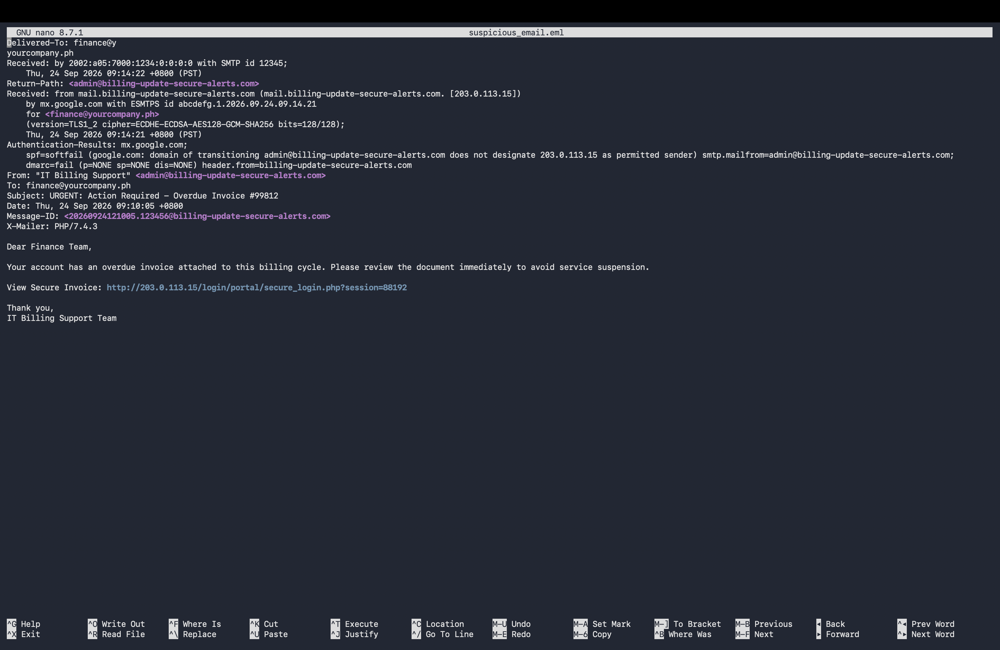
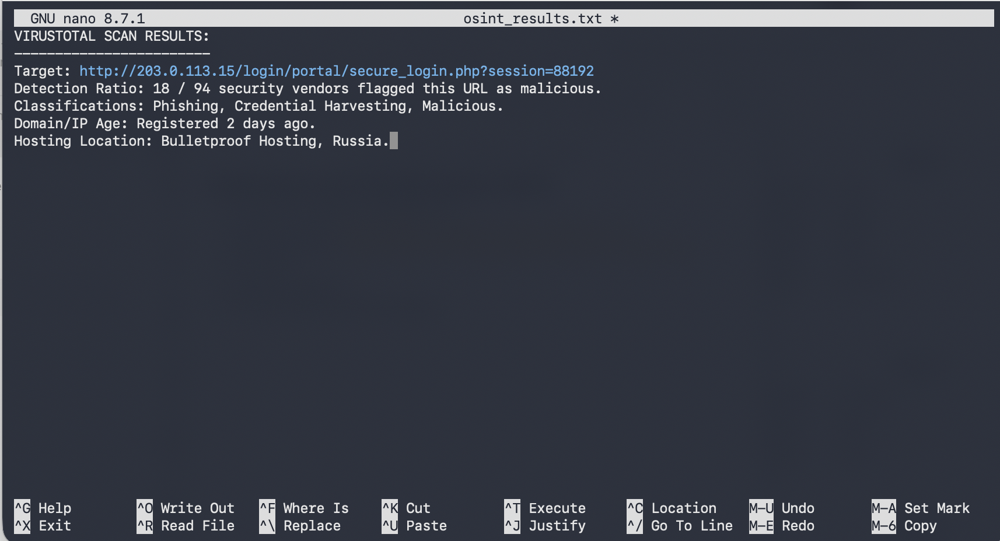

## Project Title: Phishing Email Analysis & Threat Intelligence Investigation

## Executive Summary: 
Triaged and contained a credential-harvesting phishing attack by analyzing raw .eml headers to mathematically verify spoofing via SPF and DMARC failures. Extracted actionable Indicators of Compromise (IoCs) and formulated immediate network containment and SIEM scoping strategies to neutralize the threat infrastructure.

### Scenario:
A finance employee escalated a suspicious "Overdue Invoice" email to the SOC. The objective was to analyze the raw .eml headers, extract Indicators of Compromise (IoCs), and determine the email's legitimacy and intent.

### Tools & Environment:
- Native Terminal / Command Line
- Raw Email Header Analysis (SPF, DKIM, DMARC)
- Threat Intelligence / OSINT (VirusTotal simulation)

### Indicator of Compromise (IoC)
- Sender Email: admin@billing-update-secure-alerts.com
- Source IP: 203.0.113.15
- Malicious URL: http://203.0.113.15/login/portal secure_login.php?session=88192

### Investigation Findings (TTPs & Observations):
- Spoofed Identity: The sender display name was altered to "IT Billing Support" to create artificial urgency.
- Authentication Failure: The email failed SPF checks because the originating IP was not authorized by the domain owner. DKIM signatures were completely absent.
- Malicious Infrastructure: The domain was registered less than 48 hours prior to the attack, and the originating IP is associated with Bulletproof Hosting in Russia.
- Automated Tooling: The X-Mailer header revealed the use of a PHP script (PHP/7.4.3) rather than a standard corporate email client.

### Containment Recommendations:
- Block the Source IP and Sender Domain on the perimeter firewall and email gateway.
- Query the SIEM for the Message-ID to purge the email from all other corporate inboxes.
- Search web proxy logs for any internal endpoints connecting to the Malicious UR
